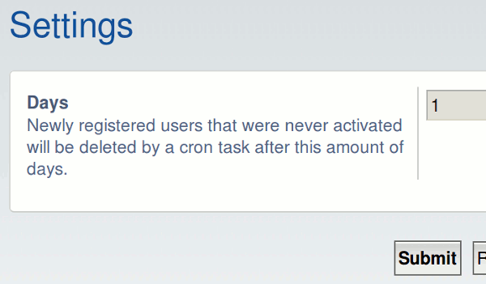

# PhpBB Extension - marttiphpbb Prune Inactive Users

[Topic on phpBB.com](https://www.phpbb.com/)

## Requirements

* phpBB 3.2+
* PHP 7+

## Features

This phpBB extension deletes with a cron task the newly registered inactive users after a configurable number of days.

## Quick Install

You can install this on the latest release of phpBB 3.2 by following the steps below:

* Create `marttiphpbb/pruneinactiveusers` in the `ext` directory.
* Download and unpack the repository into `ext/marttiphpbb/pruneinactiveusers`
* Enable `Prune Inactive Users` in the ACP at `Customise -> Manage extensions`.

## Uninstall

* Disable `Prune Inactive Users` in the ACP at `Customise -> Extension Management -> Extensions`.
* To permanently uninstall, click `Delete Data`. Optionally delete the `/ext/marttiphpbb/pruneinactiveusers` directory.

## Support

* Report bugs and other issues to the [Issue Tracker](https://github.com/marttiphpbb/phpbb-ext-pruneinactiveusers/issues).

## License

[GPL-2.0](license.txt)

## Screenshot

### ACP

